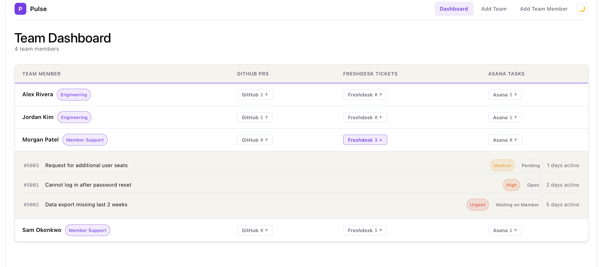

# Pulse

## An Engineering Manager's Productivity Portal

This app provides a clean, centralized overview of your team's productivity by measuring IC's sprint load, outstanding PRs, and assigned Freshdesk tickets in one panel.

## Getting Started

To run this for yourself, you'll want to populate a `.local/local.env` file - see [the template](./.local/local.env.template); this connects all your API keys to the data pipeline, and authenticates a connection to Postgres.

### Running Locally
As long as your environment file is populated, you can run `make app` to orchestrate all of these services together using Docker Compose.

* The app serves the compiled React frontend at `localhost:5000`
* The data is automatically refreshed in Postgres every 5 minutes (`RQ` serves as the caching layer and scheduler)

### Source Code Overview
| Codebase      | Description                                                                                        | Docs                                  |
| ------------- | -------------------------------------------------------------------------------------------------- | ------------------------------------- |
| Data Pipeline | This codebase hosts the `dlt` and `dbt` configurations to load and transform data for our frontend | [Link](./src/data-pipeline/README.md) |
| Web App       | This codebase defines the Flask backend and React frontend to serve as the user interface          | [Link](./src/web-app/README.md)       |

## Adding Your Team

You can customize teams and team members in the frontend (or by adding records directly to the db if that's your jam). The dbt that pulls all the disparate information together runs in the background every 5 minutes, so changes to Team Member records will be reflected there.

If you want to update the branding / styling of this page, just tweak the [Theme YAML](./src/web_app/theme.yaml) with colors, team names, logos, etc. that will override the defaults.